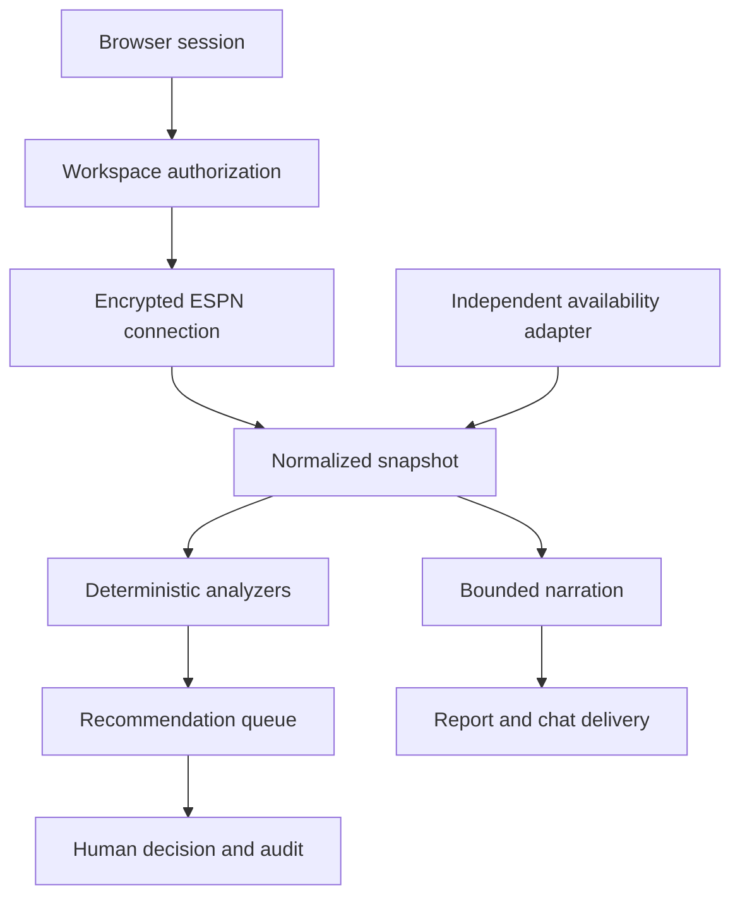

# Architecture

## Critical flow

## Boundaries

- `app/services/espn.py` is the only ESPN HTTP boundary. Provider drift stays localized.
- `app/services/availability.py` is the independent availability boundary. The zero-cost beta uses
  nflverse; commercial feeds must implement the same normalized `AvailabilityGateway` contract.
- `LeagueSnapshot` is the stable internal contract. Analysis never reads raw ESPN objects.
- `app/services/analysis.py` is deterministic and testable without an LLM or network.
- `app/services/ai.py` receives bounded league facts as untrusted JSON. It returns prose only.
- `app/services/reports.py` verifies league facts and falls back to the rules narrator if an optional
  model is unavailable.
- `app/security.py` owns encryption, token digests, browser sessions and CSRF validation.
- Every workspace-scoped route validates membership before returning whether an object exists.
- Notification targets are encrypted and delivery occurs only during an explicit test or protected job.

## Storage

The beta uses SQLAlchemy with SQLite. The schema is already workspace-scoped. PostgreSQL becomes the
correct production choice when multiple application instances or concurrent workers are introduced.
The migration trigger is a public paid beta, not an arbitrary row count.

The hosted v0.4.0 path adds a PocketBase control plane and stateless Python workers. PocketBase owns
authentication, tenant policy, job leases, reports and audit data; workers own ESPN reads and the
existing deterministic intelligence engine. See `docs/CLOUDPOD_BACKEND.md`.

## AI fallback

`rules` is the default and costs nothing. Optional providers implement the same narrator contract.
If an external model fails, the report uses deterministic narration over the same verified facts and
marks its `narration_mode` as `rules-fallback`. It never substitutes or invents league facts.

## ESPN write actions

There is no supported write adapter. Recommendation payloads explicitly contain
`execution_capability: approval-only`. Adding execution later requires a separate adapter, contract
tests, terms review, per-action preview, idempotency and a kill switch.
