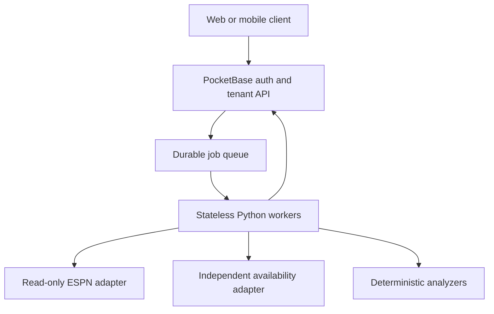

# CloudPod / PocketBase backend

LEAGUEPILOT AI v0.4.0 uses `https://leaguepilot-ai.cloudpod.pro` as its hosted control plane. The
FastAPI application remains useful for local founder operation; CloudPod adds multi-user auth,
tenant-scoped storage, a durable job queue and stateless worker coordination.

## Runtime topology



The provider boundary remains `LeagueSnapshot`. PocketBase never receives raw ESPN provider
objects, and no component implements an ESPN write action.

## Collections

The live schema is captured in `cloudpod/schema/collections.json`. User-facing collections enforce
`owner = @request.auth.id` on list/view operations. Direct client writes to connections, jobs,
recommendations, reports, usage and audit data are locked; validated hooks perform those writes.

`app_config` is inaccessible through public collection rules and its value field is hidden. It is a
CloudPod compatibility fallback because this host's PocketBase service does not currently inherit
project `.env` values. For a high-assurance production launch, inject the encryption and worker keys
from a managed host secret store and rotate away from the database fallback.

## Worker setup

Install the repository on each worker host and supply the same worker key configured in CloudPod:

```bash
python -m pip install -e .
export FCC_CLOUDPOD_URL=https://leaguepilot-ai.cloudpod.pro
export FCC_CLOUDPOD_WORKER_KEY='retrieve-from-your-secret-manager'
export FCC_CLOUDPOD_WORKER_ID="leaguepilot-worker-$(hostname)"
leaguepilot-ai worker
```

Use `leaguepilot-ai worker --once` for a scheduler, smoke test or one-job container. Worker IDs may
contain letters, digits, dots, underscores and hyphens. Never place the worker key in source,
container images, logs or GitHub Actions YAML.

The worker:

- authenticates through `X-LeaguePilot-Worker-Key`;
- atomically leases one queued job for five minutes;
- decrypts ESPN cookies only inside the claim response to that authenticated worker;
- normalizes ESPN data into `LeagueSnapshot`;
- optionally enriches player availability through the provider-neutral nflverse beta adapter;
- creates lineup, waiver, trade, urgent availability-alert and report results;
- turns completed analysis into separate idempotent Discord/GroupMe delivery jobs;
- commits results using the lease token or reports a bounded, sanitized failure;
- never returns credentials in completion payloads or errors.

Expired leases are requeued every two minutes. Failures use exponential retry and become
dead-letter jobs after the configured attempt limit.

## Client flow

1. Register or sign in through PocketBase's `users` auth collection.
2. Call `POST /api/leaguepilot/bootstrap` once; it is idempotent and returns the profile/workspace.
3. Save ESPN configuration with
   `PUT /api/leaguepilot/workspaces/{workspaceId}/connections/espn`.
4. Queue intelligence with `POST /api/leaguepilot/workspaces/{workspaceId}/analysis`, sending the
   selected `connection_id`. The ID is optional only when the workspace has exactly one league.
5. Subscribe to or query tenant-scoped recommendations, reports and jobs.
6. Record a human decision through
   `POST /api/leaguepilot/recommendations/{id}/review`.

An approval records intent only. The response explicitly reports `espn_action_executed: false`.

### Scheduled lineup-lock sweeps

CloudPod queues `inactive-sweep` jobs around Thursday, Sunday and Monday lock windows. The worker
only creates urgent recommendations when an independent source reports a current starter OUT; a
clean sweep retires an older alert for that same connection. With `notify: true`, completion queues
one idempotent delivery job per active encrypted Discord or GroupMe channel.

The nflverse founder-beta feed supplies practice participation and weekly game status. It is not a
contractual 90-minute inactive service. Before paid launch, configure a licensed Sportradar Game
Roster/Weekly Injuries or SportsDataIO Injuries implementation behind `AvailabilityGateway` and
validate its ID mapping and freshness SLA.

## Scale envelope and launch gates

The architecture scales workers horizontally and is suitable for a controlled multi-tenant beta.
PocketBase is still a single SQLite-backed control-plane node, so “thousands of users” is a load-test
target, not a guarantee. Before an unrestricted public launch:

1. run burst tests for sign-in, subscriptions, job claims and report reads;
2. configure SMTP/transactional email and verified recovery;
3. move server secrets to a host-managed secret store;
4. add external uptime, queue-depth, dead-letter and backup-restore monitoring;
5. validate backup restore and key rotation;
6. set retention/export/delete policies and complete an external security review;
7. prepare a PostgreSQL migration path if write contention or multi-region requirements exceed the
   single-node PocketBase envelope.

## Deployment verification

```bash
node --check cloudpod/pb_hooks/leaguepilot.pb.js
node --check cloudpod/pb_hooks/leaguepilot_lib.js
python -m ruff check app tests
python -m pytest --cov=app --cov-report=term-missing
python -m build
```

After deploying hooks, restart the actual PocketBase system service and verify
`GET /api/leaguepilot/health`. Writing a hook file alone does not activate it on this host.
